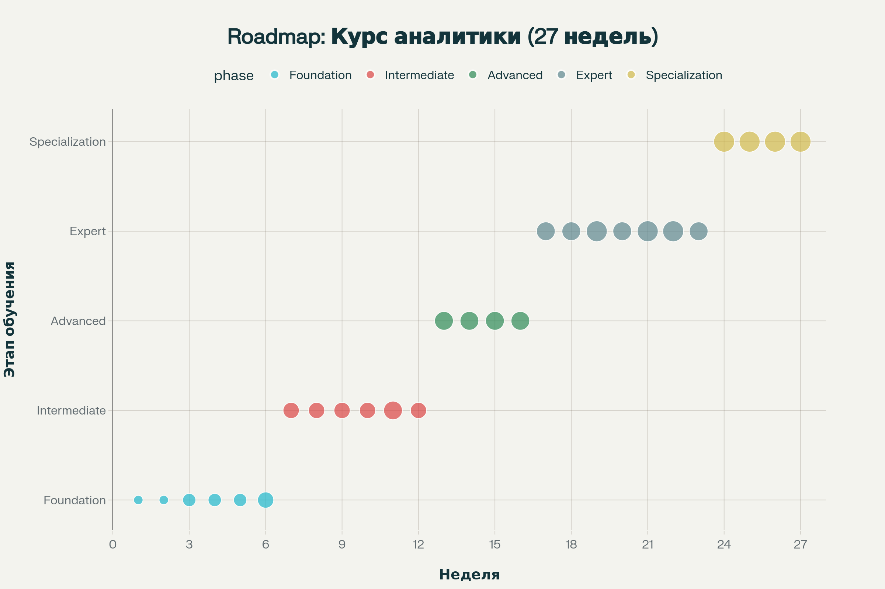
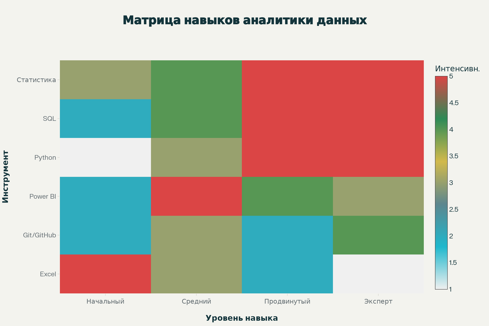

# 📊 Курс «Аналитика данных»

**Полное руководство от новичка до эксперта за 27 недель**

---

## 🎯 О курсе

Добро пожаловать в курс по аналитике данных! За 27 недель вы пройдете путь от новичка без опыта программирования до эксперта, способного решать сложные бизнес-задачи с помощью данных.

### 🌟 Что делает этот курс особенным?

- **📚 Универсальность** — примеры из ретейла, финансов, производства и маркетинга
- **🛠 Практическое обучение** — более 100 практических заданий с реальными данными  
- **⚡ Self-paced формат** — учитесь в своем темпе, когда вам удобно
- **🔧 Современные инструменты** — Excel, SQL, Python, Power BI, Git в одном курсе
- **💼 Бизнес-фокус** — каждая техника применяется к решению реальных задач

---

## 🎓 Для кого этот курс

### ✅ Идеально подходит для:
- **Новички** в аналитике данных без предварительного опыта программирования и BI
- **Самостоятельные студенты**, готовые к self-paced обучению
- **Специалисты смежных областей**, желающие освоить аналитику данных

### 🚀 Не требуется предварительных знаний
- Навыков программирования
- Опыта работы с базами данных
- Знания статистики или математики выше школьного уровня
- Дорогостоящего софта (используем бесплатные и open-source решения)

---

## 📈 Структура курса

### 📚 Фаза 1: Основы (Недели 1-6)
**Цель:** Заложить крепкий фундамент аналитических навыков

| Неделя | Глава | Тема | Инструменты |
|--------|--------|------|-------------|
| 1 | [Глава 1-2](chapter-01/README.md) | Введение в аналитику, описательная статистика | Excel, Power Query, Git |
| 2 | [Глава 3-4](chapter-03/README.md) | Сводные таблицы и визуализация | Pivot, Power Pivot, Power Query, Git |
| 3 | [Глава 5-6](chapter-05/README.md) | Подготовка данных, доверительные интервалы | Power Query, SQL, Excel |
| 4 | [Глава 7-8](chapter-07/README.md) | A/B-тесты, корреляция и регрессия | SQL, Python, Excel |
| 5 | [Глава 9-10](chapter-09/README.md) | Временные ряды, когортный анализ | Excel, Python, SQL |
| 6 | [Глава 11-12](chapter-11/README.md) | Дашборды и продвинутая визуализация | Power BI, DAX, Python |

**Результат:** Уверенное владение Excel, понимание основ статистики, первые шаги в SQL и Python

---

### 🔬 Фаза 2: Средний уровень (Недели 7-12)  
**Цель:** Освоить BI-инструменты и углубиться в аналитику

| Неделя | Глава | Тема | Инструменты |
|--------|--------|------|-------------|
| 7 | [Глава 13-14](chapter-13/README.md) | Основы DAX, загрузка и очистка данных | Power BI, DAX, Python, SQL |
| 8 | [Глава 15-16](chapter-15/README.md) | Визуализация в Python, кластеризация | Matplotlib, Seaborn, scikit-learn |
| 9 | [Глава 17-18](chapter-17/README.md) | Классификация, API-автоматизация | scikit-learn, Python, SQL |
| 10 | [Глава 19-20](chapter-19/README.md) | Основы SQL: агрегаты, JOIN, CTE | SQL, Power Query, Python |
| 11 | [Глава 21-22](chapter-21/README.md) | Модели данных, оптимизация запросов | SQL, Power Pivot, DAX |
| 12 | [Глава 23](chapter-23/README.md) | Storytelling и отчёты | Power BI, Git/GitHub |

**Результат:** Создание профессиональных дашбордов, базовое машинное обучение, уверенная работа с SQL

---

### 🎯 Фаза 3: Продвинутый уровень (Недели 13-16)
**Цель:** Мастерство в Python и продвинутых методах анализа

| Неделя | Глава | Тема | Инструменты |
|--------|--------|------|-------------|
| 13 | [Глава 24](chapter-24/README.md) | PCA и факторный анализ | Python scikit-learn, SQL |
| 14 | [Глава 25](chapter-25/README.md) | Непараметрические тесты | Python SciPy, SQL |
| 15 | [Глава 26](chapter-26/README.md) | Байесовские методы | Python PyMC3, SQL |
| 16 | [Глава 27](chapter-27/README.md) | Анализ выживаемости | Python lifelines, SQL |

**Результат:** Владение продвинутыми методами ML, оптимизация запросов, автоматизация процессов

---

### 🏆 Фаза 4: Capstone-проект (Недели 17-27)
**Цель:** Интеграция всех навыков в едином проекте

| Неделя | Описание |
|--------|-----------|
| 17-27 | [Capstone Project](capstone/README.md) — Итоговый проект с использованием всех изученных инструментов |

**Результат:** Портфолио проекта, готовность к работе аналитиком данных

---

## 🛠 Технологический стек

### 📊 Основные инструменты
- **Microsoft Excel** — основа аналитики, сводные таблицы, Power Query
- **SQL** — работа с базами данных (PostgreSQL, SQL Server)
- **Python** — pandas, NumPy, scikit-learn, matplotlib, seaborn
- **Power BI** — создание дашбордов, DAX формулы, модели данных
- **Git/GitHub** — версионный контроль, совместная работа

### 🔧 Дополнительные технологии
- **Power Query** — ETL процессы, очистка данных
- **Jupyter Notebook** — интерактивная разработка на Python
- **REST API** — интеграция с внешними источниками данных

---

## 📅 График обучения

### ⏰ Рекомендуемый темп
- **Теория:** 2,5 часа в неделю
- **Практика:** 4 часа в неделю  
- **Общий объем:** 6,5 часов в неделю
- **Длительность:** 27 недель (≈ 7 месяцев)

### 📚 Гибкий подход
- **Self-paced обучение** — двигайтесь в своем темпе
- **Модульная структура** — можете пропускать знакомые темы
- **Постоянный доступ** — материалы доступны 24/7

---

## 🤝 Поддержка и сообщество

### 💬 Получение помощи
- **📱 Telegram чат:** [@analytics_course_chat](https://t.me/analytics_course_chat)
- **📺 Telegram канал:** [@analytics_course_channel](https://t.me/analytics_course_channel)  
- **🐛 GitHub Issues:** Для технических вопросов

---

## 🎁 Что входит в курс

### 📦 Учебные материалы
- ✅ **540+ страниц теории** в удобном формате
- ✅ **100+ практических заданий** с решениями
- ✅ **50+ готовых датасетов** для практики
- ✅ **30+ шаблонов и скриптов** для работы
- ✅ **Capstone-проект** для портфолио

### 🎯 Эксклюзивные материалы
- 📖 **Книга рецептов** — 200+ готовых решений типовых задач
- 🛠 **Toolkit аналитика** — подборка лучших инструментов
- 📊 **Галерея визуализаций** — примеры лучших дашбордов
- 🎨 **Design system** — гайдлайны по оформлению отчетов

---

## 🚀 Начать обучение

### 👇 Нажмите кнопку ниже, чтобы начать свое путешествие в мир аналитики данных!

**🎯 [Перейти к Главе 1: Введение в аналитику данных](chapter-01/README.md)**

---

## ⚖️ Лицензия

Этот курс распространяется под лицензией MIT License.

**Это означает, что вы можете:**
- ✅ Использовать материалы в коммерческих целях
- ✅ Изменять и адаптировать содержание  
- ✅ Распространять среди коллег
- ✅ Создавать производные работы

**С условием:**
- 📝 Указания авторства в исходном коде

---

**🎯 Готовы начать? Переходите к [Главе 1: Введение в аналитику данных](chapter-01/README.md)**

---

*Последнее обновление: Сентябрь 2025 | Версия 2.0*